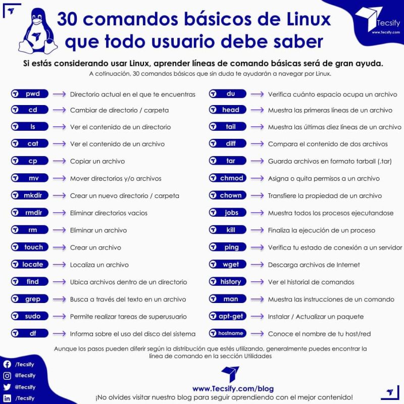

# Agenta virtual personalizada

## Atividades Concluídas
- Ideia roubada do [Amorim-cyber](https://github.com/Amorim-cyber/Progresso_Bootcamp_Spread/blob/main/README.md)

| **Boas-vindas ao Bootcamp Spread Java Developer ✔️** | **Bem-vindo à DIO ✔️** | **Mentoria #1: Aula Inaugural Spread Java Developer ✔️** | **Lógica de Programação Essencial ✔️** | **Aprenda o que são Estrutura de Dados e Algoritmos ✔️** | **Introdução ao Git e ao GitHub ✔️** |
|---|---|---|---|---|---|
| Criando seu Primeiro Repositório no GitHub Para Compartilhar Seu Progresso ✔️ | Mentoria #2: Como ser o próximo contratado da Spread | Mentoria #3: Start coding - Java Essencials 1 | Dominando IDEs Java | Variáveis, Tipos de Dados e Operadores Matemáticos em Java | Lógica Condicional e Controle de Fluxos em Java |
| Estruturas de Repetição e Arrays em Java | Reforçando o Conceito de Laços em Java | Mentoria #4: Como resolver os desafios de código | Resolvendo Desafios de Código em Java | Desafios Java Developer | Estrutura de dados em Java |
| Trabalhando com Collections Java | Introdução a orientação a objetos com Java | Abstraindo um Bootcamp Usando Orientação a Objetos em Java | SQL SERVER - Criando suas primeiras consultas | Modelando um banco de dados na prática com SQL SERVER | SQL Server: Boas práticas em bancos relacionais |
| Mentoria #5: ORACLE DATABASE - Diferenciais | Introdução a APIs e métodos HTTP | Introdução ao framework Spring Boot | Simplificando Projetos Java com o Spring Boot | Introdução aos Conceitos de API e Clean Architecture | Desenvolvendo um sistema de gerenciamento de pessoas em API REST com Spring Boot |
| Mentoria #6: Consumindo uma API Rest Com Spring. Exemplos práticos | Introdução a Qualidade de Software | Aprenda a aplicar testes com Java | Desenvolvimento de testes unitários para validar uma API REST de gerenciamento estoques de cerveja | Mentoria #7: Introdução ao teste de Software | Mentoria #8: O que você precisa saber para se tornar um desenvolvedor de sucesso na Spread |

### **Lista de principais comandos terminal bash**

## Versionamento de evolução Bootcamp Spread

| Data | Módulo | Aprendizagem e descrição do componente |
|---|---|---|
| Undefined | Boas-vindas ao Bootcamp Spread Java Developer/ Bem-vindo à DIO/ Mentoria #1: Aula Inaugural Spread Java Developer | Não lembro ao certo quando fiz, então botei tudo junto pra não ter que fazer uma descrição :smile: |
| 23/11/2021 | Lógica de Programação Essencial | Reforçou conceitos básico, teoóicos e práticos, que já havia esquecido ou não conhecia. |
| 24/11/2021 | Aprenda o que são Estrutura de Dados e Algoritmos | A apresentação das estruturas básicas que transformam o  |
| 25/11/2021 | Introdução ao Git e ao GitHub | Durante o dia a dia da faculdade acabei ficando refém do gitlens, sempre é bom entender como funcionam as coisas, o que não é diferente do git. Aprendi muito sobre como o git funciona, e seus objetos, além de que realmente estava tendo problemas com a geração de chave SSH. |
| 26/11/2021 | Criando seu Primeiro Repositório no GitHub Para Compartilhar Seu Progresso | Exercício bem trivial, mas que botou em prática a minha desorganizada organização. |

